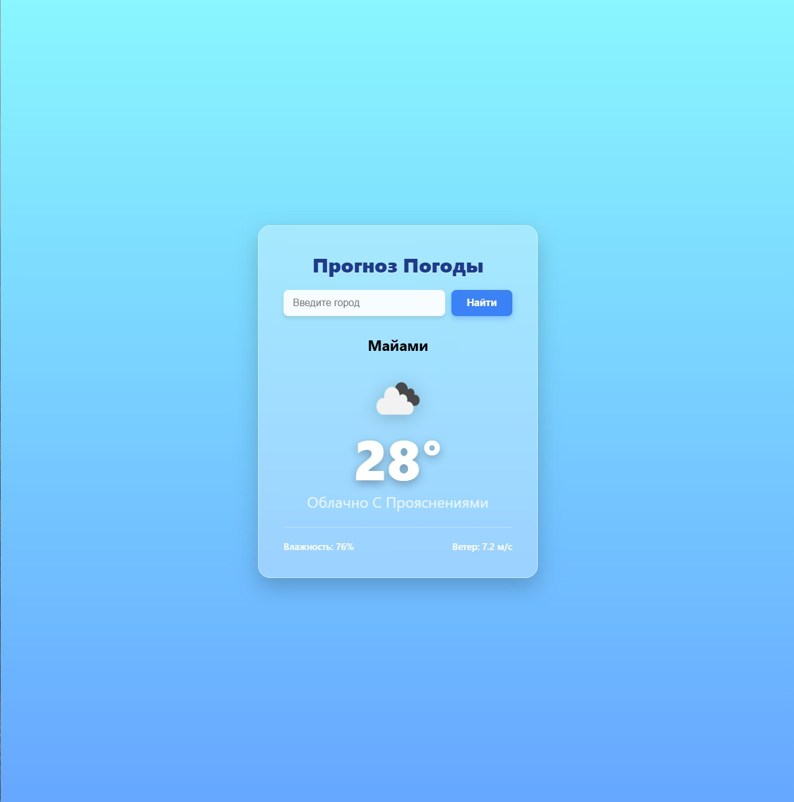
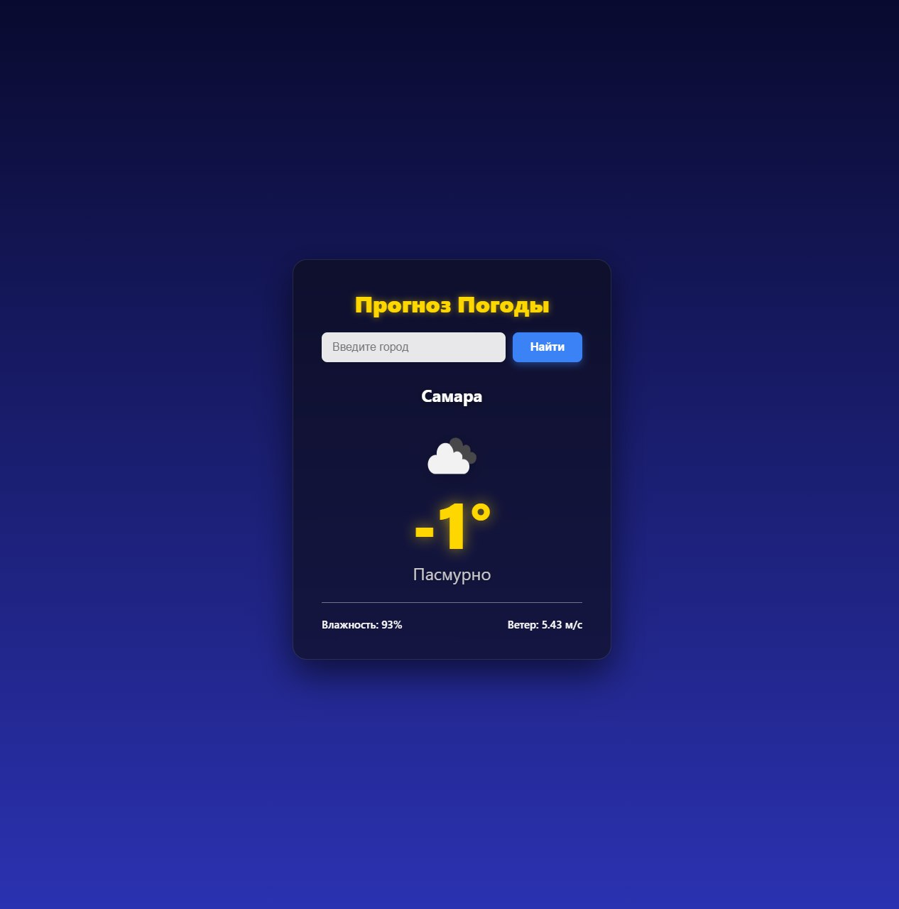

# Weather App

Простое, красивое и атмосферное веб-приложение для проверки текущей погоды в любом городе мира.

**[Живая демо-версия](https://goose-pagoda.online)**
## Скриншоты





## ✨ Особенности

- 🌤 **Реальные данные**: Температура, описание погоды, влажность, скорость ветра — всё через OpenWeatherMap API.
- 🌗 **Динамический фон**: Автоматически меняется в зависимости от времени суток в выбранном городе:
  - День → голубое небо с плывущими облаками.
  - Ночь → тёмный космос с мерцающими звёздочками (чистый CSS!).
- 📱 **Адаптивный дизайн**: Отлично выглядит на десктопе и мобильных устройствах (Mobile First).
- ⚡ **Кэширование запросов**: Данные сохраняются на 5 минут, чтобы не превышать лимиты API.
- 🐳 **Docker-поддержка**: Легко развернуть в контейнере.

## Технологии

- **Backend**: Python 3.9, Flask
- **Frontend**:  HTML5, CSS3 (Flexbox, CSS Animations, Media Queries)
- **API:**: OpenWeatherMap
- **Deployment**: Docker, Nginx, Gunicorn

## Установка и запуск локально

1. Клонируйте репозиторий:
   ```bash
   git clone https://github.com/AndrejWP/weather-app.git
   cd weather-app
   ```

2. Создайте виртуальное окружение (рекомендуется):
   ```bash
   python -m venv venv
   source venv/bin/activate  # На Windows: venv\Scripts\activate
   ```

3. Установите зависимости:
   ```bash
   pip install -r requirements.txt
   ```

4. Настройте переменные окружения (если требуется API-ключ для погодного сервиса, например OpenWeatherMap):
   - Создайте файл `.env` в корне проекта.
   - Добавьте ключ: `API_KEY=ваш_ключ`

5. Запустите приложение:
   ```bash
   python main.py  # или python app.py, в зависимости от entry point
   ```

6. Откройте в браузере: http://127.0.0.1:5000 (или другой порт, указанный в консоли).

## Запуск с Docker

1. Убедитесь, что Docker установлен.

2. Соберите образ:
   ```bash
   docker build -t weather-app .
   ```

3. Запустите контейнер:
   ```bash
   docker run -p 5000:5000 --env API_KEY=ваш_ключ weather-app
   ```

4. Откройте в браузере: http://localhost:5000

## Функциональность

- Поиск погоды по названию города.
- Отображение текущей температуры, описания, влажности, ветра и иконки погоды.
- Адаптивный дизайн (CSS в папке `static/`).

## Скриншоты

(Добавьте скриншоты интерфейса в папку `static/images/` и обновите этот раздел ссылками на них.)

## API погоды

Приложение использует внешний API для получения данных о погоде (вероятно, OpenWeatherMap или аналогичный). Для работы требуется API-ключ.

Получите ключ на [openweathermap.org](https://openweathermap.org/api) и добавьте его в переменные окружения.

## Лицензия

MIT License (или укажите свою, если отличается).

Если у вас есть предложения или нашли баг — создавайте Issue или Pull Request! 😊